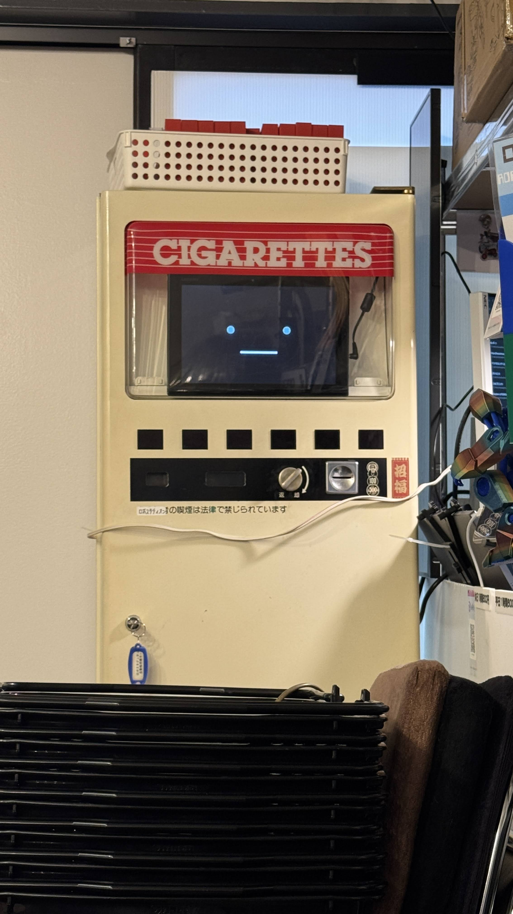
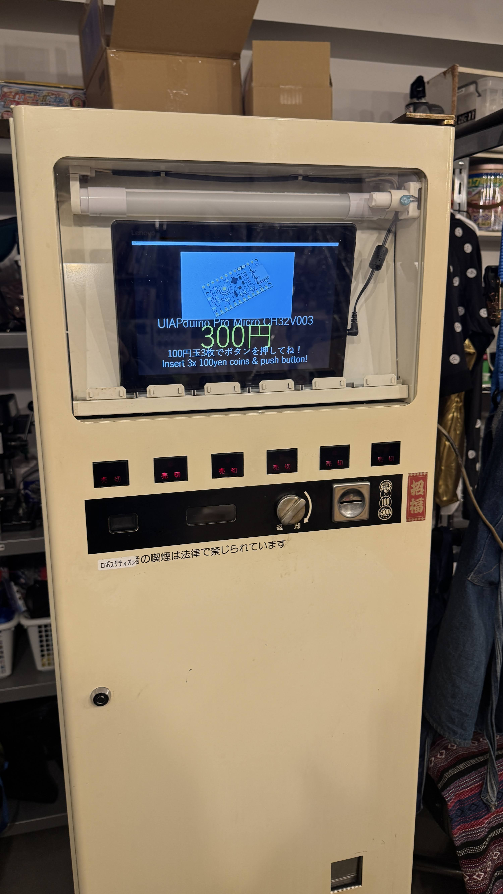
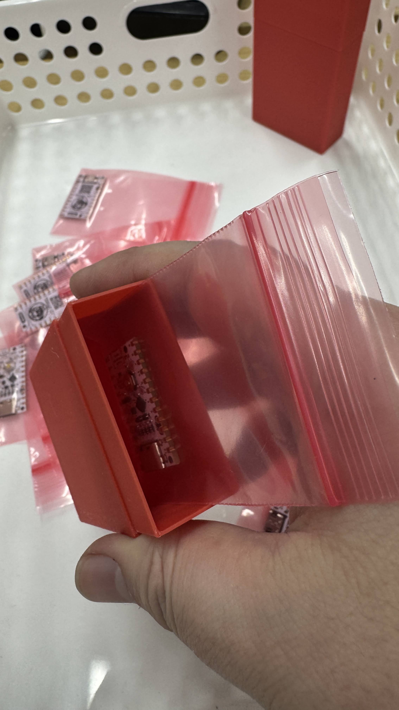
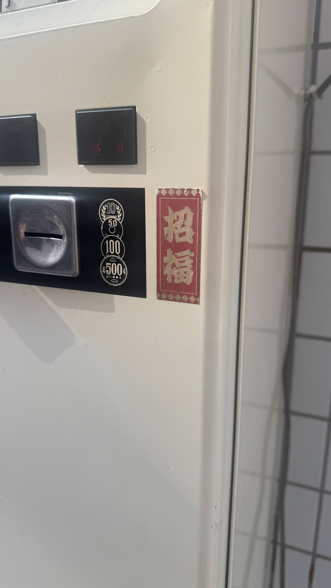
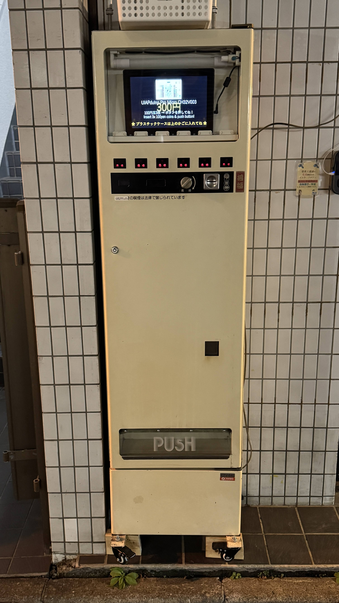

# ジハンキチャン (Jihankichan)

レトロなタバコ自販機を改造した、秋葉原のマイコンボード自販ロボット。

[stack-chan](https://github.com/meganetaaan/stack-chan) 風の顔アニメーション付きで、お客さんに話しかけます。



## 販売商品

**UIAPduino Pro Micro CH32V003** - 300円

100円玉を3枚入れてボタンを押すだけ！



## 機能

- **顔アニメーション** - stack-chan風の目・口・まばたき・呼吸アニメーション
- **製品スライドショー** - 製品画像・価格・購入案内を大型テキストで表示
- **顔認識グリーティング** - カメラで顔を検知すると日本語・英語で挨拶＆購入案内
- **TTS音声** - Windows SAPI（VBScript）による音声読み上げ
- **ニュースアナウンス** - Claude APIで10分ごとに秋葉原ニュースを生成・読み上げ
- **カメラ配信** - Flask Webサーバーでカメラ映像をストリーミング（http://localhost:8080）
- **録画** - 3日分の映像を自動ローテーション保存
- **売り切れモード** - `SOLD_OUT = True` で売り切れ画面に即切替
- **夜間ミュート** - 23時〜8時は音声を出さず字幕のみ表示

## スクリーンショット

| 顔アニメーション | スライドショー |
|:---:|:---:|
|  |  |

| 商品パッケージ | コイン投入口 |
|:---:|:---:|
|  |  |

## セットアップ

### 必要なもの

- Windows PC（ディスプレイ接続）
- USB Webカメラ
- Python 3.12+

### インストール

```bash
pip install pygame pillow numpy opencv-python flask pyttsx3
```

Claude APIでニュース機能を使う場合：

```bash
pip install anthropic
set ANTHROPIC_API_KEY=your-api-key-here
```

### 製品画像の配置

`images/` ディレクトリに製品画像（JPG/PNG/WEBP）を配置すると自動でスライドショーに表示されます。

### 起動

```bash
python stackchan_full.py
```

全画面で起動します。`ESC` キーで終了。

### キー操作

| キー | 動作 |
|------|------|
| `ESC` | 終了 |
| `C` | カメラ切替 |
| `N` | ニュース読み上げ（手動） |
| `1` | 通常表情 |
| `2` | 嬉しい表情 |
| `3` | 悲しい表情 |
| `4` | 怒り表情 |

## 設定

`stackchan_full.py` 内の定数で各種設定を変更できます：

```python
PRODUCT_NAME = "UIAPduino Pro Micro CH32V003"  # 商品名
PRODUCT_PRICE = "300円"                         # 価格
SOLD_OUT = False                                # 売り切れモード
SLIDESHOW_INTERVAL = 5                          # スライド切替間隔（秒）
NEWS_INTERVAL = 600                             # ニュース間隔（秒）
NIGHT_START_HOUR = 23                           # 夜間ミュート開始
NIGHT_END_HOUR = 8                              # 夜間ミュート終了
```

## ファイル構成

```
jihankichan/
├── stackchan_full.py          # メインスクリプト（顔・スライドショー・TTS・カメラ全部入り）
├── stackchan_watchdog.py      # クラッシュ時の自動再起動ウォッチドッグ
├── start_stackchan.bat        # Windows起動バッチ
├── images/                    # 製品画像ディレクトリ（自動読み込み）
├── jihankichan_Photo/         # プロジェクト写真
│   └── UIAPduino/             # UIAPduino製品画像
├── stackchan_face.py          # 顔アニメーション単体版
├── stackchan_simple.py        # シンプル版
├── stackchan_camera.py        # カメラ機能単体版
├── setup_stackchan.sh         # Linux用セットアップスクリプト
└── setup_remote.ps1           # リモートセットアップ用PowerShell
```

## 設置場所

秋葉原のロボスタディオン店頭に設置されています。



## ライセンス

MIT License
